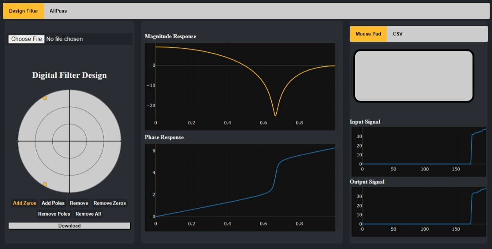
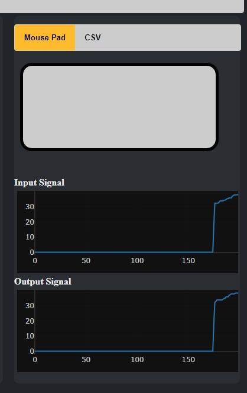
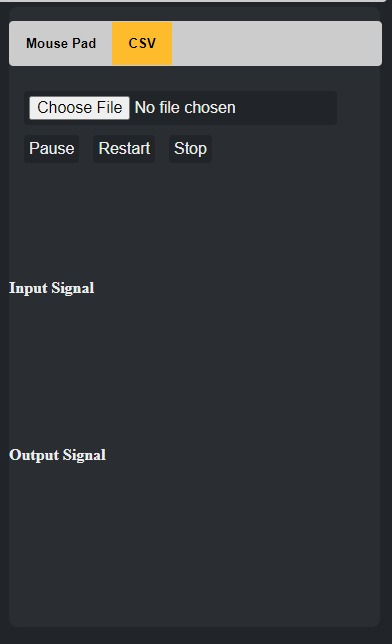
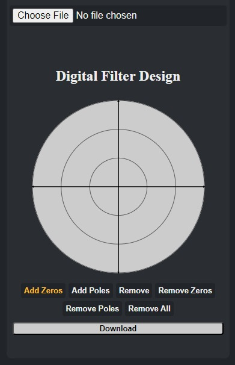
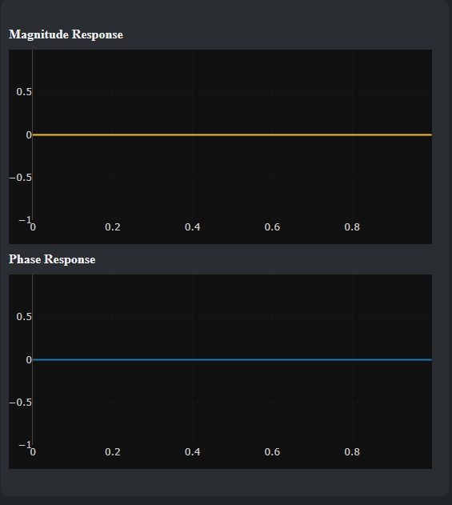
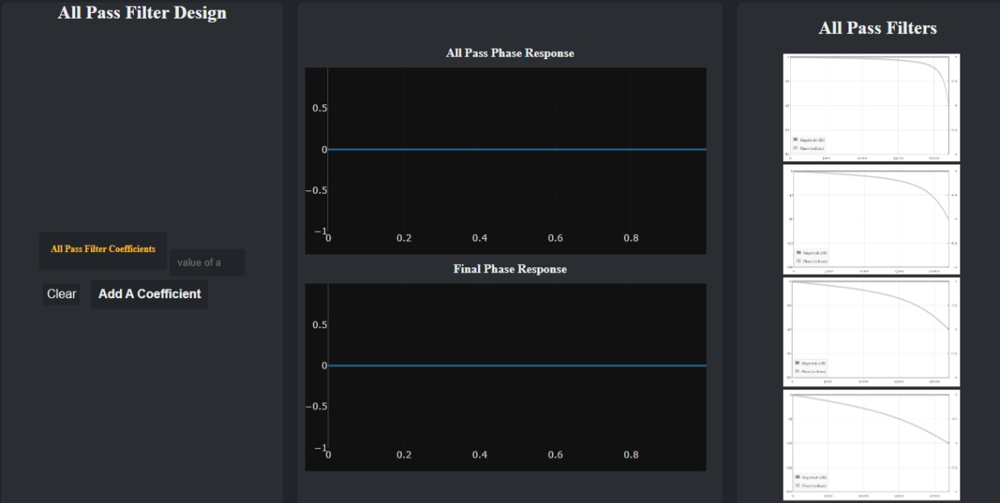

# Digital_Filter_Design

Digital filters play a crucial role in digital signal processing (DSP), which is the field of study concerned with the analysis, processing, and manipulation of digital signals. They are used to filter out unwanted noise or interference, extract specific frequency components, and shape the frequency response of a system. They can be used in a wide range of applications, including audio and video processing, communications, control systems, and biomedical engineering.

The two main types of digital filters used in DSP are finite impulse response (FIR) filters and infinite impulse response (IIR) filters. FIR filters are characterized by a finite-length impulse response, meaning that they only respond to a finite number of input samples. IIR filters, on the other hand, have an impulse response that extends infinitely into the past and future.

Designing digital filters involves choosing the filter parameters, such as the cutoff frequency, passband ripple, and stopband attenuation, based on the specific requirements of the application. Several methods can be used to design digital filters, including windowing, frequency sampling, and optimization techniques such as least-squares or minimax approximation.

## Table of Contents

- [Built with](#Built-with)
- [Deployment](#Deployment)
- [Design](#Design)
- [Features](#Features)
- [Authors](#Authors)


## Built with


## Deployment

 Install Flask

```bash
  pip install Flask
```
To start deployment 
```bash
  flask run app.py
```

## 🖌️ Design



## Features
There are different parts in the main window: 
1.Mouse_pad Mode: Where the input is the position of mouse is considerd as the input signal of the program that being filterd.



2.CSV file Mode: Where you can upload a csv file with the values of point and being drawn.



3.Unit Circle: Where you can put zeros and poles and depend on the position we can draw the adjacent filter, you can also add or remove the zero and poles



4.Magnitude and Response graphs: where you the magnitude and response are plotted to deal with.



5.All Pass page: This is considerd the second page where we try to modify the existed filter and consisted of two parts the plots of magnitude and response after the all pass filter and catalog for some examples.


